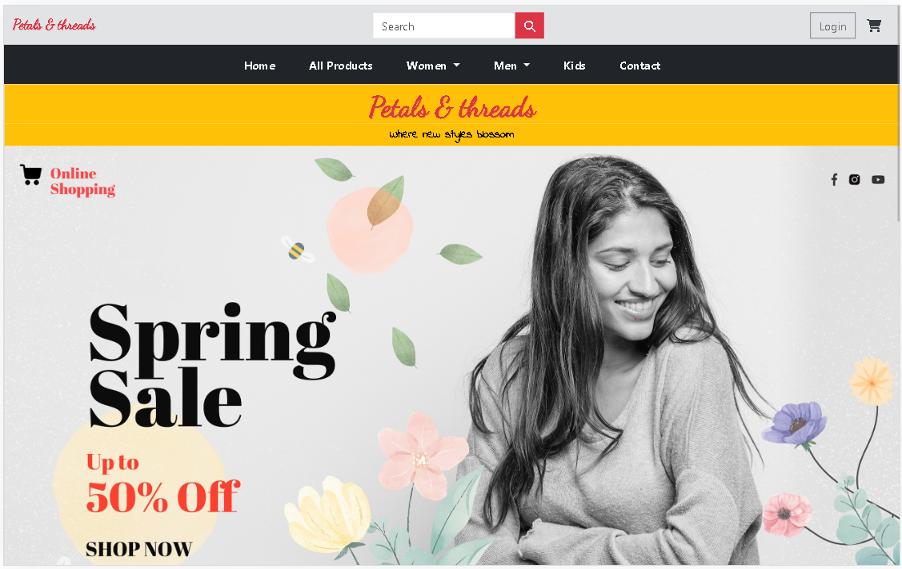
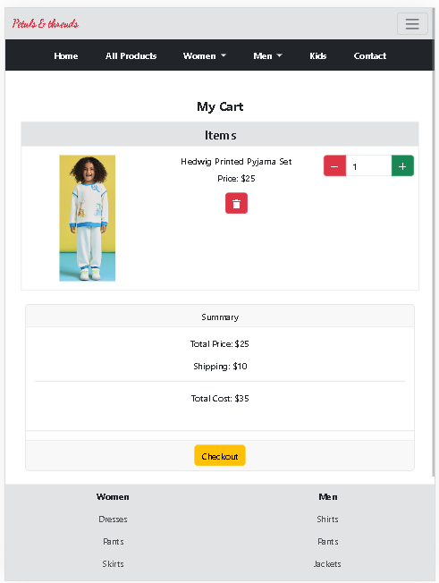
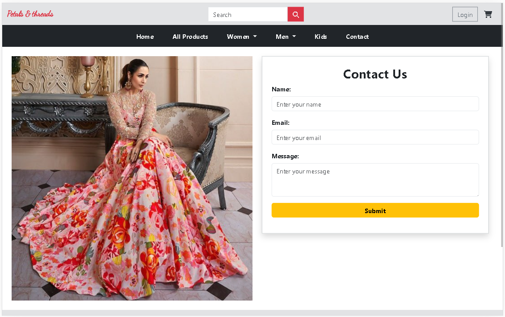
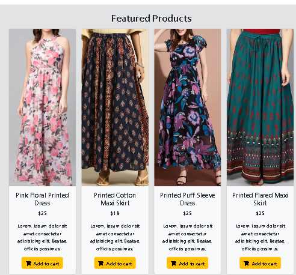
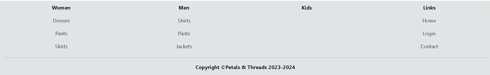
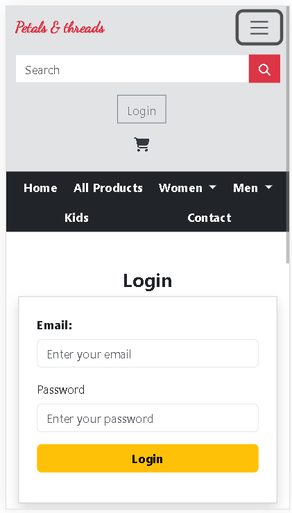
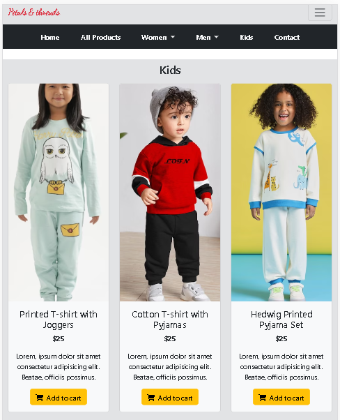

# Petals & Threads

Petals & Threads is an e-commerce website project focused on providing a visually appealing and fully functional platform for buying floral-themed clothing and accessories. This project utilizes HTML, CSS, Bootstrap 5, and JavaScript for front-end development, with plans for back-end implementation in the future.

## Table of Contents
- [Introduction](#introduction)
- [Features](#features)
- [Usage](#usage)
- [Technologies Used](#technologies-used)
- [License](#license)

## Introduction

The Front-End Development Project provides an opportunity to apply theoretical knowledge of web development to create a practical e-commerce website. Split into two phases, the project focuses on front-end development initially, with back-end implementation scheduled for later.

## Features

- **Header and Footer**: Includes elements like the logo, search box, cart, and login buttons, styled using Font Awesome icons. User-friendly navigation bar with dropdowns and links to different product categories.
- **Home Page**: Features a striking cover image with the company's logo and slogan, showcasing featured products using a responsive Bootstrap 5 carousel.
- **Product Pages**: Utilize grid layouts, simple cards, and a 'Add to cart' button.
- **Contact Page**: Includes a simple form within a responsive layout, incorporating an image representing the business and theme.
- **Login Page**: Styled with a form and JavaScript functionality for login validation.
- **Cart Page**: Displays items with images, names, prices, and quantity adjustments, with emphasis on visual aesthetics and responsiveness.

## Usage

1. Clone the repository:
   ```
   git clone https://github.com/nknithi/petals-and-threads.git
   ```
2. Navigate to the project directory:
    ```
   cd petals-and-threads
   ```
3. Open the index.html file in your web browser to view the website locally.


## Technologies Used

- HTML
- CSS
- Bootstrap 5
- JavaScript
- Font Awesome
- Google Fonts
  
## Screenshots

<p align="center"></p>
<p align="center"></p>
<p align="center"></p>
<p align="center"></p>
<p align="center"></p>
<p align="center"></p>
<p align="center"></p>

## Technologies Used

- HTML
- CSS
- Bootstrap 5
- JavaScript
- Font Awesome
- Google Fonts

## License

This project is not licensed.

## Additional Information

For any questions or further information, please contact [nknithi2018@gmail.com](mailto:nknithi2018@gmail.com).
